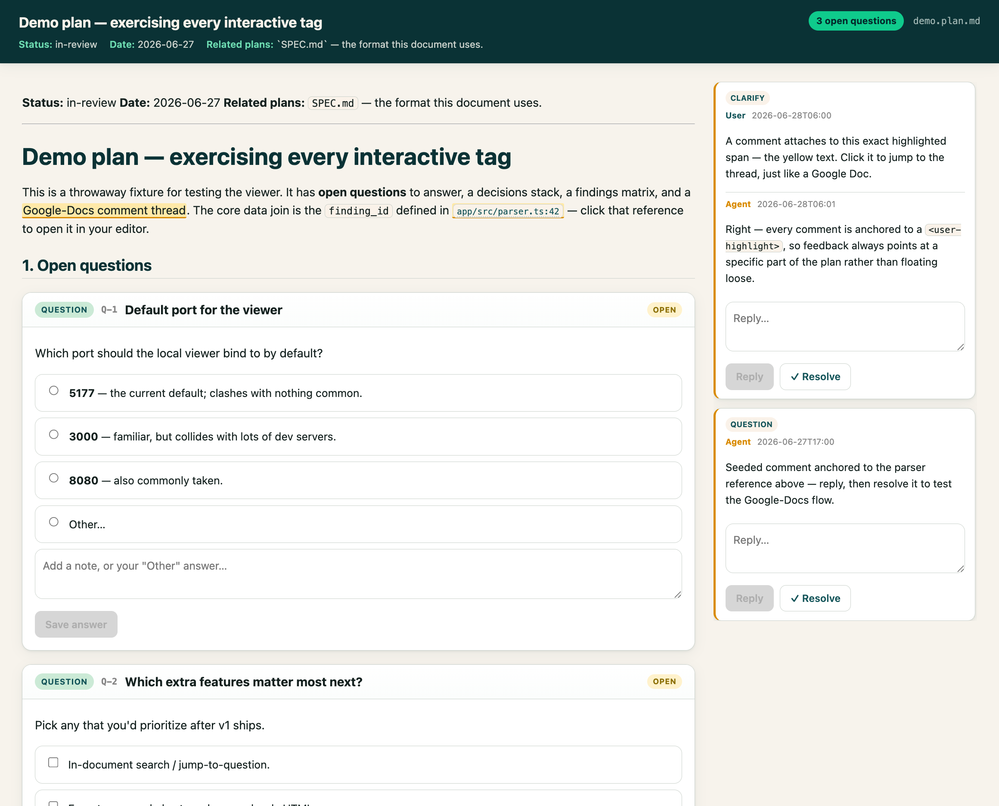
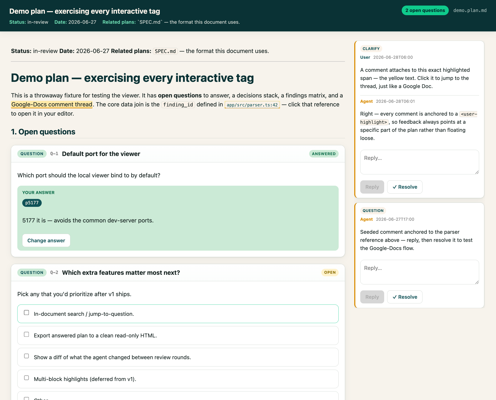

# sangho-no-skills

> Personal [Claude Code](https://claude.com/claude-code) skills, each built to kill a specific bit
> of friction in how I actually work with coding agents.

Three skills today, in a layout that lets me drop in more. Each top-level directory is one
self-contained skill; install once and Claude Code auto-loads them in any repo.

Forked from [`josephcc/joseph-no-skills`](https://github.com/josephcc/joseph-no-skills), whose
design for `interactive-plan` and `codex-audit` I've kept largely intact. The writing-voice skill
has been rebuilt around my own papers.

| Skill | One-liner |
|---|---|
| [**`interactive-plan`**](#-interactive-plan--read--comment-on-plans-like-a-google-doc) | Turn long planning docs into an interactive web page — answer questions, pick options, and comment Google-Docs-style; feedback round-trips into the same `.md`. |
| [**`codex-audit`**](#-codex-audit--a-second-pair-of-eyes-on-your-diff-triaged-with-judgment) | Have the OpenAI Codex CLI audit your diff, then triage its report with independent judgment — verify each finding, reject false positives, fix what's real. |
| [**`write-like-sangho`**](#-write-like-sangho--paper-prose-in-my-voice-not-an-llms) | Draft and revise academic-paper sections in my writing voice, grounded in section-by-section examples from my published papers (the examples themselves are local-only, not in the repo). |

---

## 🗺️ `interactive-plan` — read & comment on plans like a Google Doc

**What it's for.** Planning a big feature means iterating with the agent for *hours* to produce a
detailed spec before touching code. The two things that matter most in those docs are the **open
questions** and the **decisions already made**. The problem is the medium: reading and editing long
plans as raw markdown is miserable. This skill lets you *read* a plan, *make decisions*, and
*comment on any line* — like a Google Doc — then hand it back to the agent to revise, in a loop,
until it's ready to implement.

`interactive-plan` defines a tagged-markdown plan format and a local web viewer for it. The plan
stays a single `.md` file (git-diffable, readable by any agent), but the viewer renders its
`<open-question>`, `<decision>`, `<finding>`, and `<comment>` tags as interactive UI — and every
answer and comment you make **writes straight back into the same file**.



Pick options (every choice gets an **"Other" + free-text** escape hatch), and comment on any
highlighted span — threads you and the agent can both reply to and resolve:



**Highlights**
- **Single `.md` source of truth** — no sidecar; the tags carry state (`status="open|locked"`, …) so both the renderer and any agent understand them.
- **Five tags**: open questions (single/multi choice + Other + freeform), decisions (lockable, with rationale), Google-Docs comments anchored to highlighted spans, and audit findings (filterable severity matrix).
- **Live round-trip**: the viewer watches the file and re-renders when the agent rewrites it, and warns on edit conflicts.
- **Clickable code refs**: `file.ts:123` opens in your editor (default [Cursor](https://cursor.com), configurable).
- **One shared server** for all plans, keyed by `?plan=<path>` — no swarm of localhost ports.
- **Open straight from your editor**: a keybinding / command-palette task opens the focused `.md` in the viewer (reusing the shared server, never spawning a duplicate) — copy-paste configs for [Cursor/VS Code](interactive-plan/docs/cursor-integration.md) and [Zed](interactive-plan/docs/zed-integration.md).

**The loop:** agent writes/updates a plan → you open the viewer, answer & comment → it saves back
into the `.md` → "review my feedback on plan X" → agent revises → repeat until you're happy →
implement. Full format spec in [`interactive-plan/SPEC.md`](interactive-plan/SPEC.md).

---

## 🔍 `codex-audit` — a second pair of eyes on your diff, triaged with judgment

**What it's for.** At the end of a task, having the **OpenAI Codex CLI review the changes** gives
you an independent audit report — but that report isn't gospel, and pasting it back into the Claude
Code thread to work out which findings are real is tedious every single time. This skill automates
the whole loop.

`codex-audit` scopes the diff, writes a focused brief, runs `codex exec review` (read-only,
sandboxed), then **triages every finding against the actual code** — verifying each claim, rejecting
false positives with evidence, fixing what's genuinely worth fixing, and presenting a disposition
table. Codex is treated as *a capable second opinion, not an authority*.

**Highlights**
- Runs Codex strictly **read-only**; all repo edits are made by Claude after triage, never by Codex.
- Every finding is **re-verified and re-rated** — no blindly applying an external tool's output.
- **Per-repo opt-in** for auto-triggering (an empty `.codex-audit-enabled` marker), since it sends repo context to an external service.
- Defers "how do I verify a fix" to your `CLAUDE.md` rather than hard-coding test commands.

---

## ✍️ `write-like-sangho` — paper prose in my voice, not an LLM's

**What it's for.** When an agent helps me draft a paper section, the prose comes out fluent but
generic — LLM vocabulary, LLM cadence, LLM tells everywhere. I don't want "academic style"; I want
*my* style. This skill grounds the agent in verbatim sections from my published papers, organized
by section type (`examples/introduction/`, `examples/rq-results/`, `examples/framework/`, …), so it
reads how I actually open an intro or report a study before writing a word of mine.

**Highlights**
- **Corpus-grounded blocklist**: every "LLM word" rule is frequency-checked against my published
  writing — words I never use are banned with their counts as evidence, and words I genuinely do
  use (that naive lists ban) are kept, with usage guidance and a mined "what I write instead" table.
- **A section map derived from my papers, not assumed** — including slots Joseph's original didn't
  have: RQ-structured results, conceptual/framework sections, systematic-review method, and
  classroom deployments.
- **Context loading strategy**: per-section dependency table (e.g., related work loads the draft's
  own intro/abstract for framing and the method for differentiation claims).
- **Honest placeholders** (`[CITE: …]`, `[TODO(sangho): …]`, `[CHECK: …]`) instead of fluent filler
  or invented citations, plus a citation report on every handback: new citations flagged for
  vetting, stretched citations shown with evidence and reasoning.
- **Gated per repo**: the skill refuses to imitate unless a `.i-am-sangho` marker file exists at
  the repo root (`touch .i-am-sangho`) — same opt-in pattern as `codex-audit`, but hard: no
  marker, no voice, even when invoked explicitly.
- **The voice doesn't ship**: `examples/` is gitignored — only the instructions are in the repo.
  `tools/build-corpus.py` regenerates it from PDFs; swap in your own papers and it's
  `write-like-you`.

---

## Install

```bash
git clone git@github.com:sanghos-ai2/sangho-no-skills.git
cd sangho-no-skills
./install.sh        # symlinks each skill into ~/.claude/skills/
```

`install.sh` is re-run safe: it replaces existing symlinks and refuses to overwrite a real
directory (so it won't clobber a skill you've edited in place). To install a subset, edit the
`SKILLS` array at the top of the script. Then run `claude` in any repo — skills load from
`~/.claude/skills/`.

**Per-skill requirements**
- `interactive-plan` — [Bun](https://bun.sh) (the viewer is a Vite/React app + a small Node daemon; first launch runs `bun install` + build automatically). Optional: an editor CLI for click-to-open refs (defaults to `cursor`; install it from Cursor's Command Palette → *Shell Command: Install 'cursor' command*, or change `interactive-plan/config.json`).
- `codex-audit` — the [OpenAI Codex CLI](https://github.com/openai/codex) (`brew install codex`, then `codex login`) and a git repo.
- `write-like-sangho` — no tooling to run the skill, but the gitignored `examples/` corpus must be populated locally before it can imitate anyone. Build it with `uv run --with pymupdf tools/build-corpus.py`.

## Wire the skills into a repo

These skills hook into a couple of `CLAUDE.md` conventions (where plans live, how you verify, when
to run an audit). [`CLAUDE.example.md`](CLAUDE.example.md) is a starter you can copy the relevant
parts of into your repo's `CLAUDE.md`.

## Add your own skill

1. Create a top-level `my-skill/` directory with a `SKILL.md` (copy the frontmatter + body conventions from an existing skill).
2. Add it to the `SKILLS` array in `install.sh` and a row in the table above.
3. Commit, then `./install.sh` links it into `~/.claude/skills/`.

## License

[Apache-2.0](LICENSE) © 2026 Sangho Suh. Forked from
[`joseph-no-skills`](https://github.com/josephcc/joseph-no-skills) © 2026 Joseph Chang, also
Apache-2.0.
