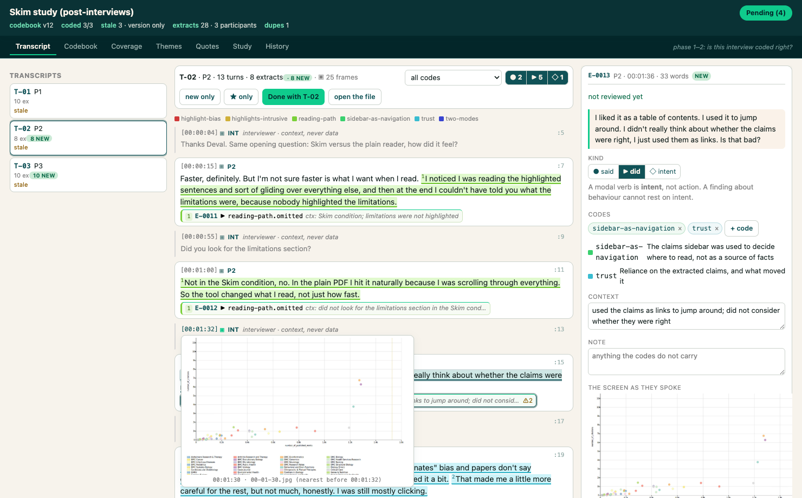
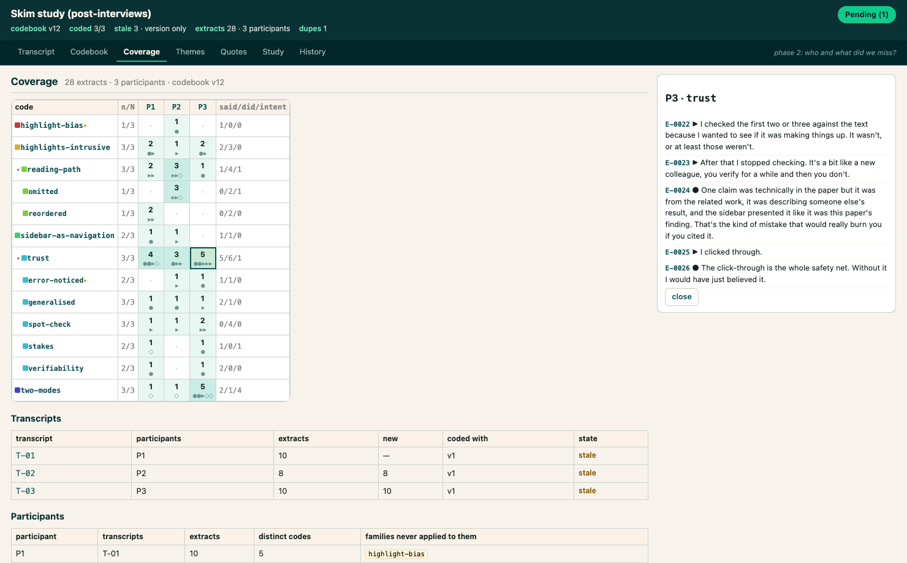
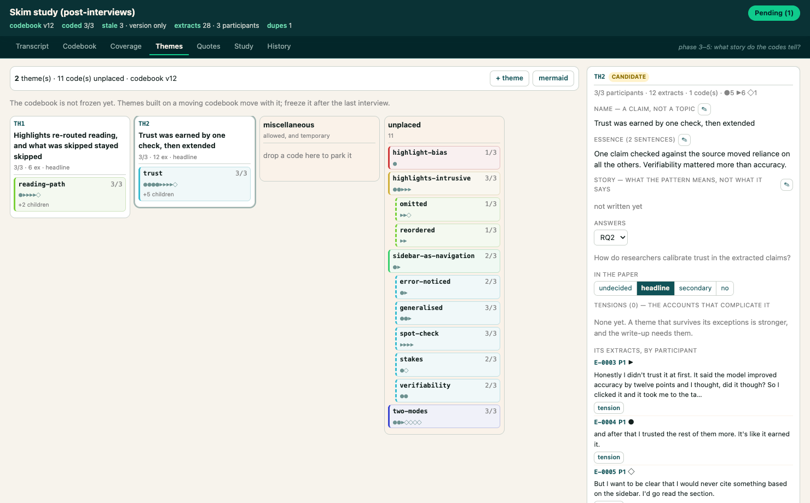
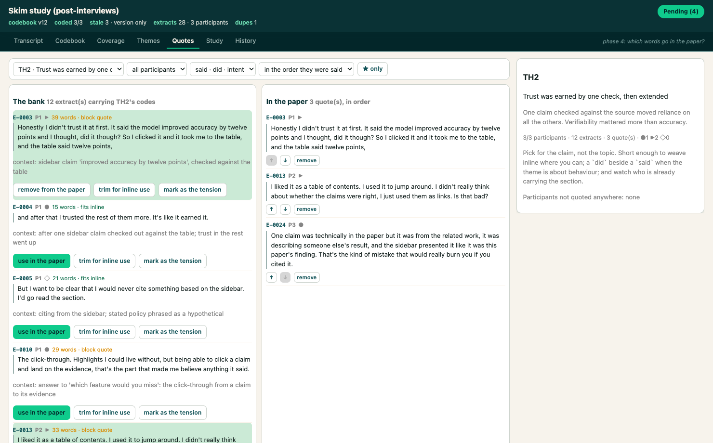

# Using `thematic-analysis`

A Braun & Clarke thematic analysis of interview transcripts in which **you drive and the agent
supports**. It works as an experienced qualitative analyst would: it reads every transcript,
notices what recurs, and proposes codes and themes with the extracts behind them — as a spread of
options, grounded in your research questions and your draft, not a single verdict. You decide.
Which codes stay, which themes the data supports, which quotes go in, and what the paper argues
are yours.

Each new interview is two jobs done together: it codes the transcript against the codebook you
already have, so this one is comparable with the rest, and it brings you the passages nothing
covered as candidate codes to rule on.

Two things make that practical. **Reviewing**: the coding is drawn on the transcript, every
timestamp opens the frame from the recording, and the codebook is a structure you can take apart —
so checking the work is cheap enough that you actually do it. **Reading everything, every time**:
a code you just wrote gets carried back across all the transcripts, which is how you learn it was
under-applied in the first interview, that it overlaps a code you wrote last week, or that two
participants never triggered it at all.

Nothing it claims about the data is unchecked: quotes are copied out of the transcript by script
and re-verified, and coverage is computed rather than estimated.

`SKILL.md` in this folder is written for the agent. This file is written for you.

---

## The loop

```
    you, in chat ──▶ "P7's session is in recordings/p7, code it"
                          │
                          ▼
    the agent   reads the transcript whole · codes it · proposes candidate codes
                writes the round document · opens the workbench
                          │
                          ▼
    you, in     dispute a coding · accept a code · move a card · pick a quote
    the         every gesture appends ONE operation to analysis/inbox.jsonl
    workbench   ── nothing in the analysis has changed yet ──
                          │
                          ▼
    you, in chat ──▶ "review my feedback"
                          │
                          ▼
    the agent   ta.py inbox      reads what you staged, grouped by view
                ta.py apply --all executes it, cascades, archives the pass
                replies to your threads · re-reads what a new code touches
                          │
                          ▼
    the workbench redraws itself.  You do not reopen it.  ◀── the part people expect to be manual
```

**You never close or reopen the workbench.** It watches the analysis folder and reloads when the
agent writes to it. Leave it open for the whole study; switch to it when you want to review,
switch to chat when you want to hand a pass back.

**Chat is the hand-back, and that is deliberate.** There is no "submit" button. A review is
finished when you say it is, not when the tool decides you have clicked enough. Say
*"review my feedback"* — the agent picks up everything you staged.

**Nothing you click changes the analysis.** The browser writes exactly one file, `inbox.jsonl`,
and `ta.py apply` is the only thing that touches `study.yaml`, `codebook.yaml`, `extracts.jsonl`
and `themes.yaml`. If you stage something you regret, undo it in the Pending drawer before
handing back — after that, it is a new operation.

---

## Starting a study

Point the agent at your transcripts (from `watch-recording`, or any file whose turns start with a
speaker label):

> Set up a thematic analysis for the exit interviews in `study/recordings/`.

It creates `study/analysis/` and drafts a roster from the speaker labels it finds. **Then it will
ask you to finish the roster**, and it cannot proceed without you: deciding who counts as a
participant is analytic work, not clerical. A room mic is several people; a colleague who joined
for ten minutes is context, not data.

It will *not* ask you about the analytic stance. Hybrid, semantic, realist, prevalence per
participant is the default, already written into `study.yaml`. Change it in the Study view if this
study really differs.

**The method it follows.** The skill reads Braun & Clarke in full before it starts — from
`source/`, which is gitignored, because the book is not mine to redistribute. Drop your own copy
in and run `scripts/extract_source.sh` once; without it the skill falls back to
`references/braun-clarke-digest.md` and tells you it did, so you always know which one the
analysis was done against.

---

## The four operations

### A. Code an interview — repeat, one interview at a time

> P7's session is in `recordings/p7/`. Read it and update the codebook.

The agent reads the whole transcript before coding a line, codes it against the current codebook,
proposes candidate codes with their evidence and its argument for each, and hands you two things:

- **the workbench**, opened on that transcript — this is where you check the coding;
- **a round document** in the plan viewer — this is where you read *why*, and answer the
  questions that are not operations (a coding policy, the stance, what to watch for next time).

Review the coding in the Transcript view: spans tinted by code family, one chip per extract
carrying its id, kind and codes, definitions beside the passage. Scrolling past an extract accepts
it; **Done with T-07** stamps the rest as reviewed, so the next round costs what changed rather
than what exists. Accept or reject the new codes in the Codebook view, where their extracts are.


A `did` claim should not rest on what someone remembers saying they did. If the recording went
through `watch-recording`, every timestamp in the transcript carries its frame: hover for the
screen as they spoke, click for full size. The extract inspector shows the same frame for the
extract you are reading, and names which one it used — the nearest at or before the line, never a
guess.



Then: *"review my feedback"*.

A codebook grows crooked if nobody prunes it. Codes stay at most two levels deep, and when a round
adds extracts but no new codes, ask for a **cleanup review**: the agent looks for a parent carrying
more than its children, a child that is a special case of its sibling, and two criteria pointing
the same way under different names, then proposes the merges *with the extracts that would move*.
The Codebook view's health strip counts those shapes for you, and **compare** puts any two codes
side by side with the extracts each one holds.


### B. Freeze the codebook and code everything

> No more interviews are scheduled. Freeze the codebook and code all the transcripts against it.

Prevalence computed from a selective pass is a number that looks like evidence and is not, so this
pass codes every transcript against the frozen codebook — including the ones coded early, when the
codebook was smaller. Afterwards, review only what it added: the Transcript view's **new only**
filter shows exactly that.

Now the Coverage view is worth reading, because every cell is a fact rather than an artefact of the
order you happened to code in. Click a number to read the extracts behind it; click an *empty* cell
to ask for a re-read of that participant for that code.



### C. Develop themes

> Let's do themes.

The Themes view is a board: codes are cards, themes are columns, dragging stages an assignment.
Each theme's inspector holds its essence (with the two-sentence scope test), its story, its
research question, and its tensions — the accounts that complicate it, which the write-up needs.
The round document carries the overall story and the naming questions; the board carries the
moving.



### D. Pick the quotes

> Pick the quotes for the themes going in the paper.

The Quotes view shows the whole bank per theme with word counts and an inline/block mark, the
ordered list of what is going in, and the attribution spread updating as you choose — so
"a results section that quotes P3 seven times is a case study of P3" is caught while you are
choosing rather than afterwards. To shorten a quote, select the words: the script cuts them out of
the stored extract, so the paper's version is still transcript text and still verifies.



### Then the write-up

> Write the results section from the themes.

`ta.py report` hands the writing step a verified quote bank, the themes with their n/N, the
codebook appendix, and an audit. Every quote in any draft can be re-checked against the
transcripts with `verify-quotes`.

It writes to HCI conventions, which live in `references/writing-up.md`: themes stated as claims and
tagged with the research question they answer, prevalence given per participant with the
"frequency does not determine value" caveat attached, rules for when a quote is inline and when it
is a block, a method paragraph that discloses the agent's role, and why a reflexive TA does not
report inter-rater reliability.

---

## Two surfaces, and which is for what

|  | The workbench | The round document |
|---|---|---|
| carries | **operations over data** — dispute a coding, accept a code, move a card, choose a quote | **arguments and judgements** — why this code exists, what the theme means, which coding policy to adopt |
| you | click, drag, select | read, answer, comment |
| opens with | `ta.py … open` | the `interactive-plan` viewer |
| written to | `inbox.jsonl`, by your clicks | the `.plan.md` itself, by your answers |

If a question could be answered by a click, it belongs in the workbench. If answering it needs a
sentence, it belongs in the document. The agent should never ask you something in prose that it
would then have to translate back into a command.

---

## What is in the analysis folder

```
analysis/
├── study.yaml        who the participants are, and the analytic stance
├── codebook.yaml     the codes, their definitions, and the changelog   ← the source of truth
├── extracts.jsonl    every coded passage, verbatim, with its locator   ← written only by ta.py
├── themes.yaml       the themes, the codes they gather, the chosen quotes
├── inbox.jsonl       what you staged, waiting for the agent            ← written only by the browser
├── memos.md          dated notes written during the analysis
├── reviews/          every round document, and every applied pass
└── reports/          generated: quote bank, themes, coverage, codebook, audit
```

`codebook.yaml` is the source of truth; everything in `reports/` is a rendering of it. If you
leave comments on a rendered file, the agent archives that copy before regenerating, so the
feedback is never lost — but the place to say it is the workbench or the round document.

---

## Things you can say at any point

- *"Which participants said something about X?"* — answered from the extracts, with ids, never
  from memory.
- *"What did P4 actually say about the sidebar?"* — extract ids and their exact text, or a fresh
  read of the transcript.
- *"Is this theme carried by everyone or by three people?"* — from `coverage`, as n/N.
- *"Re-read T-04 for `trust.stakes`, I think we missed it there."* — or click the empty cell in
  the Coverage view, which stages the same request.
- *"Show me the audit."* — validate, verify, coverage and duplicate suspicions, printed.

---

## Running it yourself

You rarely need to, but:

```bash
# open the workbench on an analysis folder (a transcript, code, theme or view name also works)
uv run ~/.claude/skills/thematic-analysis/scripts/ta.py -d <study>/analysis open T-07

# is the daemon up? where? stop it
node ~/.claude/skills/thematic-analysis/app/server.mjs --status
node ~/.claude/skills/thematic-analysis/app/server.mjs --stop

# what have I staged that the agent has not applied?
uv run ~/.claude/skills/thematic-analysis/scripts/ta.py -d <study>/analysis inbox
```

One workbench daemon serves every study, on port 47821 when it is free. It stays alive between
sessions; that is not a leak.

---

## When something looks wrong

**A button seemed to do nothing.** Check the Pending count in the header and the toast. Every
gesture stages exactly one operation and says so. If the count went up, it worked — the analysis
files just have not changed yet, and will not until the agent applies it.

**The page looks stale after the agent worked.** It reloads on its own, within a second. If it
does not, the daemon may have been restarted under it; reload the tab.

**"stale · 3 need a pass".** A code was added or reworded after those transcripts were coded, so
Braun & Clarke's phase 2 says they need another look for that code. The agent handles it on the
next pass; `stale` names which codes changed.

**An operation refused.** It keeps its reason in the inbox and the rest of the pass still runs.
Retiring a code that still holds extracts, or rewording a definition the agent has since changed,
are the common ones. Fix the cause and hand back again.

**Something is marked `stalled`.** An `apply` died holding it. It is deliberately *not* retried,
because whether it took effect is a question about your data, not one to guess at. Check, then
tell the agent to apply it by id, or discard it.
